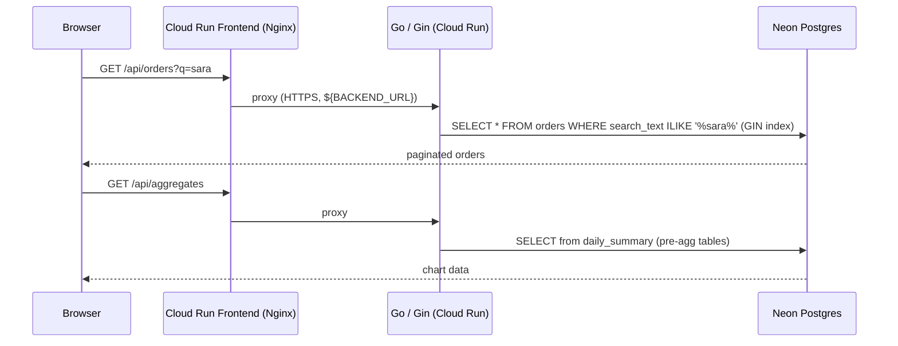

# go-dashboard-backend — Go 1.25 + Gin + GCP Cloud Run

Production-grade **Go 1.25 / Gin** REST API delivering sub-second responses across
4 million orders: full-text search, pre-aggregated analytics tables, serverless autoscaling,
custom Go migration runner, and database on Neon serverless Postgres. Two independent GCP Cloud Run
services (lite scale-to-zero, full always-warm) — no IaC framework, `gcloud run deploy` direct from `deploy.sh`.

---

## Live Service

| Endpoint | URL |
|---|---|
| **App** | available on demand |
| **API** | available on demand |
| **Portfolio demo** | https://bganguly.github.io/#go_dashboard |

> Cloud Run scales to zero when idle; run deploy.sh to provision GCP infrastructure and start the service.

---

## Using the App

Open **`/api-explorer`** on the running frontend to run live requests against every endpoint from the browser — no curl required.

1. **List orders** — `GET /api/orders` returns a paginated, date-sorted list of orders; response header shows total row count and query time.
2. **Full-text search** — `GET /api/orders?q=<term>` hits the GIN index on the denormalized `search_text` column; sub-second response times on 4 M+ rows.
3. **Aggregates** — `GET /api/aggregates?from=<date>&to=<date>&topCategories=<n>` returns daily order totals and revenue by product category from pre-aggregated summary tables.
4. **Customers** — `GET /api/customers` lists customers; supports optional `q` filter.
5. **Regions** — `GET /api/regions` returns the distinct region list used by the filter sidebar in the frontend.
6. **Status** — `GET /api/status` and `GET /api/seed-stats` return runtime info and row counts.

---

## Architecture

### Search & chart request flow — step by step

1. **Browser → Nginx frontend** — the React UI sends `GET /api/orders?q=sara` to the Cloud Run frontend service (Nginx on port 80), which substitutes `${BACKEND_URL}` from env at container start and proxies `/api/*` to the Go backend over HTTPS.
2. **Go → search** — Gin routes the request to `OrderHandler.List`; pgx v5 queries `SELECT * FROM orders WHERE search_text ILIKE '%sara%'` against Neon Postgres via the GIN index.
3. **Chart path** — `GET /api/aggregates` is served entirely from pre-aggregated `daily_summary` tables; Go never touches raw `orders` on the chart path.
4. **Credential injection** — `DATABASE_URL` is passed as a Cloud Run env var at deploy time from `deploy.sh`; no Secret Manager required at this scale.
5. **Results → browser** — Go returns paginated JSON; the React frontend renders the orders table and Recharts chart.



### Topology

```
┌─────────────────────────────────────────────────────────────────────────┐
│                              GCP Project                                │
│                                                                         │
│   Artifact Registry                                                     │
│   ┌──────────────────┐                                                  │
│   │  frontend image  │    ◄── gcloud builds submit (deploy.sh)         │
│   │  backend image   │         multi-stage Dockerfile                  │
│   └──────────────────┘                                                  │
│           │ image pull                                                  │
│           ▼                  gcloud run deploy (no Pulumi / Terraform)  │
│                                                                         │
│  Cloud Run: go-dash-{lite|full}-frontend                                │
│  ┌─────────────────────────┐   Cloud Run: go-dash-{lite|full}-backend   │
│  │ Nginx (port 80)         │   ┌────────────────────────┐               │
│  │ • serves Vite dist      │   │ Go 1.25 / Gin (8080)  │               │
│  │ • proxies /api/* ───────┼──►│ • REST /api/*         │               │
│  │   ${BACKEND_URL} env    │HTTPS• custom migrations   │               │
│  │ • 0–1/1–3 instances     │   │ • pgx v5 pool         │               │
│  └─────────────────────────┘   │ • 0–1/0–5 instances   │               │
│           ▲                    └──────────┬────────────┘               │
│           │ HTTPS                         │ HTTPS                       │
│       Browser                             │                             │
└───────────────────────────────────────────┼─────────────────────────────┘
                                            │
                              ┌─────────────▼──────────┐
                              │  Neon serverless PG    │
                              │  (external, shared)    │
                              │  • orders (4 M rows)   │
                              │  • GIN index           │
                              │  • pre-agg summary     │
                              │  • auto-suspends idle  │
                              └────────────────────────┘

Deploy flow
───────────
local machine
  └─ go-dashboard-backend/scripts/deploy.sh
       ├─ DB prompt: auto-detects Neon URL from sibling springboot repo
       ├─ psql preflight check → fails fast on bad URL
       ├─ gcloud builds submit → Artifact Registry (content-hash skip)
       └─ gcloud run deploy go-dash-{lite|full}-backend
            writes .env.gcp.{mode} with BACKEND_URL for frontend deploy

  └─ go-dashboard-frontend/scripts/deploy.sh  (separate step)
       ├─ reads BACKEND_URL from backend .env.gcp.{mode}
       ├─ gcloud builds submit → Artifact Registry
       └─ gcloud run deploy go-dash-{lite|full}-frontend
            with BACKEND_URL env var → Nginx template substitution
```

### Key design decisions

| Concern | Approach |
|---|---|
| **Search performance** | Denormalized `search_text` column with one GIN index — sub-second ILIKE on 4 M rows, single index hit per query |
| **Chart performance** | Pre-aggregated `daily_summary` tables — chart queries never touch raw `orders` on the hot path |
| **Migration runner** | Custom Go migration runner (sequential `.sql` files in `migrations/`) — runs at server startup, no external framework |
| **Connection pooling** | pgx v5 `pgxpool` — connections reused across requests, no per-request connect overhead |
| **No IaC overhead** | `gcloud run deploy` called directly from `deploy.sh` — zero Pulumi/Terraform state files, simpler ops |
| **BFF proxy** | Nginx frontend substitutes `${BACKEND_URL}` at container start via `nginx.conf.template`; browser sees a single origin, no CORS |
| **Content-hash image tags** | `gcloud builds submit` with SHA256 of source files — skips Cloud Build when nothing changed |

---

## Stack

| Component | Implementation |
|---|---|
| **Go back-end** | Go 1.25, Gin v1.10, pgx v5, godotenv |
| **PostgreSQL — SQL, DML/DDL, performance tuning** | Neon serverless Postgres; custom Go migration runner; GIN index; pre-aggregated summary tables for sub-second chart queries on 4 M rows |
| **Serverless / cloud-native computing** | Cloud Run — images in Artifact Registry; min-instances: 0 (lite) or 1 (full), scales to zero |
| **CI/CD pipelines** | `deploy.sh` — Cloud Build → Artifact Registry → `gcloud run deploy` |
| **Secrets management** | `DATABASE_URL` passed as Cloud Run env var at deploy time — no Secret Manager overhead |
| **BFF / integration layer** | Nginx frontend proxies `/api/*` to Go backend via `${BACKEND_URL}` env var; no CORS required |
| **RESTful APIs / microservices** | Two independent Cloud Run services; paginated list endpoint + aggregates endpoint |
| **Performance optimization** | Sub-second ILIKE search on 4 M rows via GIN index; pre-aggregated daily tables cut chart query time from seconds to milliseconds |
| **System design diagrams** | See architecture section above |

---

## Deployment / Running

```bash
./scripts/deploy.sh      # local [1] or GCP [2/3]
./scripts/infra-down.sh  # teardown GCP [1/2/3]
```

`./scripts/deploy.sh` prompts for local or GCP. The GCP remote flow:

| Step | What happens |
|---|---|
| **Check GCP access** | Verifies `gcloud` CLI; checks active account — installs or authorises if missing |
| **Resolve project & region** | Reads `gcloud config` for project ID and region |
| **DB prompt** | Auto-detects Neon URL from sibling `springboot-dashboard-backend` `.env.gcp.*`; shows masked URL; Y to reuse or enter new |
| **DB preflight** | Verifies `psql` connectivity to Neon before building the image — fails fast on bad URL |
| **Build backend image (if needed)** | Hashes `cmd/` + `internal/` + `Dockerfile` + `go.mod` → 16-char tag; skips Cloud Build if already in Artifact Registry |
| **Deploy Cloud Run** | `gcloud run deploy go-dash-{lite\|full}-backend` with `DATABASE_URL`, `CORS_ORIGIN`, `MIGRATIONS_DIR` env vars |
| **Write `.env.gcp.{mode}`** | Saves `BACKEND_URL`, `NEON_DATABASE_URL`, `SERVICE_NAME` for use by the frontend deploy script |

### Cost

| Resource | Cost |
|---|---|
| **Cloud Run (lite)** | Scale-to-zero — ~$0 when idle |
| **Cloud Run (full)** | Min 1 instance — ~$5–10/mo |
| **Neon Postgres** | Free tier — auto-suspends when idle (~$0/mo) |
| **Artifact Registry** | Negligible at demo image count |
| **Cloud Build** | Free tier covers demo-frequency builds |

---

## Scale & Performance

> **4 M+ orders** in Neon serverless Postgres — sub-second full-text search via GIN index on a denormalized `search_text` column; millisecond chart aggregates via pre-aggregated summary tables; zero sequential scans on the hot path.

```
Browser ──HTTPS──► Nginx / Cloud Run ──proxy /api/*──► Go 1.25 / Gin (Cloud Run) ──HTTPS──► Neon Postgres
                   go-dash-{mode}-frontend              go-dash-{mode}-backend                 4 M+ rows · GIN index
                   0–1/1–3 instances                    0–1/0–5 instances                      pre-agg summary tables
```
